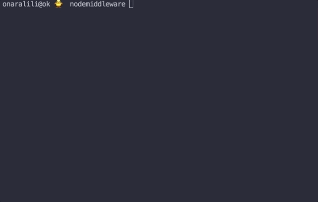

A node.js app. reads data from serial-port.
For interaction, app will read connected devices and ask you to choose one of them to connect.




### Build
As this is a node.js app. you need to have Node.js installed on your machine.
After that run following commands in the terminal:
```
git clone https://github.com/onaralili/node-serialport-reader.git
```
```
npm install
```
```
node index.js
```
